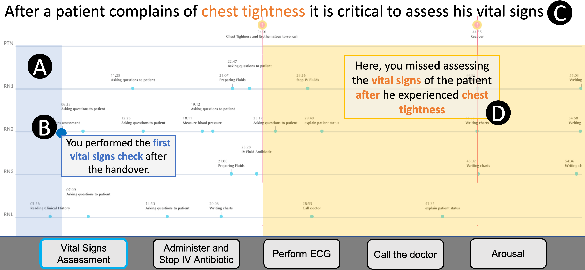
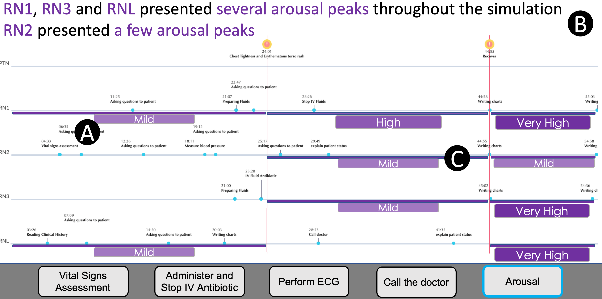
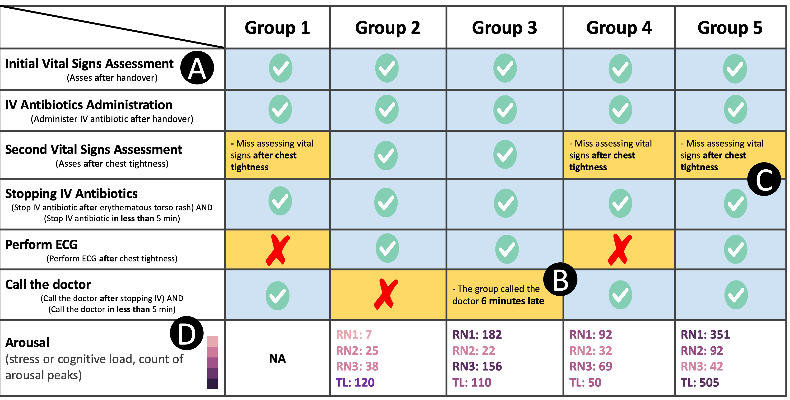
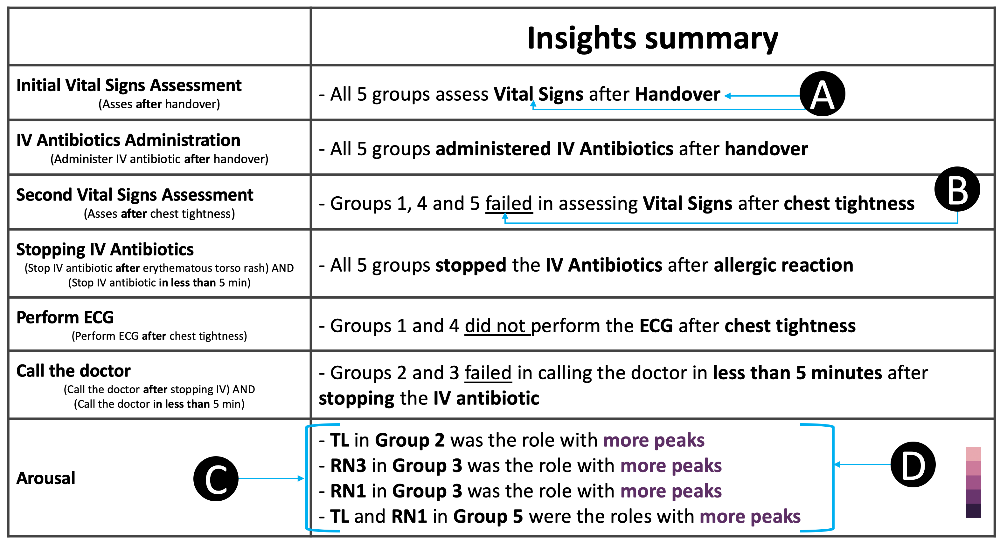
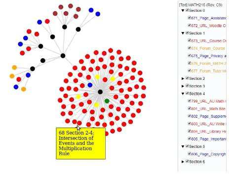
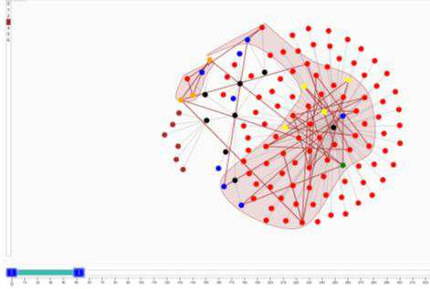
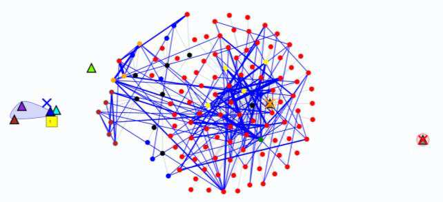
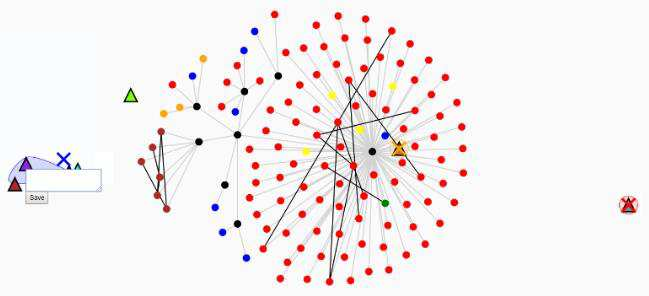

<!--
author:   Andrea Charão

email:    andrea@inf.ufsm.br

version:  0.0.1

language: PT-BR

narrator: Brazilian Portuguese Female

comment:  Referências comentadas sobre Learning Analytics, Visualization, Moodle

-->

<!--
nvm use v10.23.0
liascript-devserver --input README.md --port 3001 --live
-->

# Learning Analytics, Visualização e Moodle

> Recortes, anotações e referências sobre uma promissora e cativante área de pesquisa!

  

## Learning Analytics

Uma das muitas definições:

> *LEARNING ANALYTICS is the measurement, collection, analysis and reporting of data about learners and their contexts, for purposes of understanding and optimising learning and the environments in which it occurs [...]. Learning analytics is both an academic field and commercial marketplace which have taken rapid shape over the last decade. As a research and teaching field, Learning Analytics sits at the convergence of Learning (e.g. educational research, learning and assessment sciences, educational technology), Analytics (e.g. statistics, visualization, computer/data sciences, artificial intelligence), and Human-Centered Design (e.g. usability, participatory design, sociotechnical systems thinking)*.

From:  Society for Learning Analytics Research (SoLAR) https://www.solaresearch.org/about/what-is-learning-analytics/

Keywords: **learning** - **analytics** - **human-centered design**

## Visualização em Learning Analytics

- Esta área tem gerado muitas publicações com produções de ferramentas e revisões
- Vale iniciar conhecendo as **revisões sistemáticas**, que apontam para outros trabalhos
- Vale também filtrar trabalhos que tratem especificamente sobre visualizações no Moodle e/ou a partir de dados do Moodle

### Revisões gerais

Seguem algumas revisões sistemáticas selecionadas 

#### [Vieira; Parsons; Byrd, 2018] - uma ótima revisão sistemática sobre o assunto

??
Camilo Vieira, Paul Parsons, Vetria Byrd, Visual learning analytics of educational data: A systematic literature review and research agenda, Computers & Education, Volume 122, 2018. https://doi.org/10.1016/j.compedu.2018.03.018

> The results from this systematic review suggest that: (1) little work has been done to bring visual learning analytics tools into classroom settings; (2) few studies consider background information from the students, such as demographics or prior performance; (3) traditional statistical visualization techniques, such as bar plots and scatter plots, are still the most commonly used in learning analytics contexts, while more advanced or novel techniques are rarely used; (4) while some studies employ sophisticated visualizations, and some engage deeply with educational theories, there is a lack of studies that both employ sophisticated visualizations and engage deeply with educational theories.

Comentários:

- Ótima introdução ao assunto
- Lacunas e descobertas importantes
- Journal de alto impacto
- Verificar disponibilidade do PDF via Portal de Periódicos Capes
- Verificar citações e cited by

#### [Schwendimann et al., 2017] - uma das primeiras revisões sobre o assunto

??
B. A. Schwendimann et al., "Perceiving Learning at a Glance: A Systematic Literature Review of Learning Dashboard Research," in IEEE Transactions on Learning Technologies, vol. 10, no. 1, pp. 30-41, 1 Jan.-March 2017, https://doi.org/10.1109/TLT.2016.2599522

> The initial search of five main academic databases and GScholar resulted in 346 papers out of which 55 papers were included in the final analysis. Our review distinguishes different kinds of research studies as well as various aspects of learning dashboards and their maturity regarding evaluation. As the research field is still relatively young, most studies are exploratory and proof-of-concept. The review concludes by offering a definition for learning dashboards and by outlining open issues and future lines of work in the area of learning dashboards. There is a need for longitudinal research in authentic settings and studies that systematically compare different dashboard designs.

Comentários:

- Uma das primeiras publicações de revisão sobre Learning Dashboards
- Discute métodos e enquadramento de tipos de estudos/pesquisas nesta área

Imagens:

#### [Sahin; Ifenthaler, 2021] - um book chapter sobre o assunto

??
Sahin, M., Ifenthaler, D. (2021). Visualizations and Dashboards for Learning Analytics: A Systematic Literature Review. In: Sahin, M., Ifenthaler, D. (eds) Visualizations and Dashboards for Learning Analytics. Advances in Analytics for Learning and Teaching. Springer, Cham. https://doi.org/10.1007/978-3-030-81222-5_1

> Seventy six studies were selected as the primary studies. These studies consist of journal articles and conference papers. Detailed information about the conferences and journals of these papers is presented. Categories were determined which consist of (1) keywords, (2) stakeholders (target group) and year, (3) study group (participants), (4) visualization techniques, (5) method, (6) data collection tools, (7) variables, and (8) theoretical background. The findings of the eight categories are presented and discussed.

Comentários:

- Capítulo de livro recente
- Parece menos impactante que o journal article [Vieira; Parsons; Byrd, 2018]
- Verificar disponibilidade do PDF via Portal de Periódicos Capes
- Verificar citações e cited by

#### [Oliveira; Rodrigues; Maciel, 2022] - uma revisão sistemática brasileira

   

??
DE OLIVEIRA, Pamella L. S.; RODRIGUES, Rodrigo Lins; MACIEL, Alexandre M. A.. Revisão Sistemática da Literatura sobre Modelos de Visualizações Utilizados para Analisar Fenômenos Educacionais em Plataformas de LMS. In: SIMPÓSIO BRASILEIRO DE INFORMÁTICA NA EDUCAÇÃO, 33. , 2022, Manaus. Anais [...]. Porto Alegre: Sociedade Brasileira de Computação, 2022. p. 1006-1015. DOI: https://doi.org/10.5753/sbie.2022.224997. 

Comentários:

- Boa introdução ao assunto em português
- Boas referências para seguir adiante
- Conclusões/resultados basicamente replicam o que já foi mostrado em trabalhos anteriores
- Lacunas continuam em aberto: *carência de trabalhos que utilizam: técnicas de predição, visualizações sofisticadas, e análise dos modelos de visualização para a natureza das variáveis. *

### Moodle

- Especificamente sobre visualizações no Moodle e/ou a partir de dados do Moodle, também há muitos trabalhos - vários deles podem ser encontrados nas revisões sistemáticas
- Para iniciar neste campo específico, vale conhecer 2 TCCs recentes da UFRGS, que citam outros relacionados

#### [Paim, 2022]: um TCC sobre visualização de interações

??
Paim, Eduardo Chaves. Ferramenta para visualização de interações de estudantes em recursos do ambiente Moodle. Trabalho de Conclusão de Curso - Ciência da Computação, UFRGS, 2021. http://hdl.handle.net/10183/251780

> *Este trabalho apresenta uma ferramenta que processa dados de logs fornecidos pela plataforma Moodle e os apresenta em uma visualização interativa que permite identificar os comportamentos dos usuários com os diferentes recursos do Moodle e suas possíveis relações com o desempenho acadêmico* 

Comentários:

- Visualizações em forma de árvore/grafo
- Identificação de comportamentos dos estudantes na interação com o Moodle como forma de apoiar o gerenciamento do processo de aprendizagem - hipótese de que estudantes que interagem pouco vão evadir?
- Usuário = professores, administradores (conferir)
- Tem uma comparação com trabalhos relacionados recentes, por exemplo Brito, Medeiros e Bezerra (2019)

Imagens:

 

 

#### [Guimarães, 2021]: um TCC sobre visualização de trajetórias de aprendizagem

??
Guimarães, Jéferson Ferreira. Ferramenta para visualização de trajetórias de aprendizagem de alunos em cursos da plataforma Moodle. Trabalho de Conclusão de Curso - Ciência da Computação, UFRGS, 2021. http://hdl.handle.net/10183/235560

>  *Este trabalho propõe uma ferramenta capaz de traçar trajetórias de aprendizagem para alunos de cursos na plataforma Moodle, amplamente utilizada por instituições de ensino. As trajetórias são geradas em formas de grafos representando o acesso a diferentes recursos educacionais e as notas dos alunos nas disciplinas.* 

Comentários:

- Visualização de trajetória/progresso na forma de uma linha horizontal com eventos (+ legenda)
- Progresso pode indicar tanto bom aproveitamento como estudantes em risco
- Usuário = professores (conferir)
- Tem uma validação usando TAM (Technology Acceptance Model): questionário de usabilidade aplicado a um grupo de educadores do grupo do PPGIE (Informática na Educação) da UFRGS

Imagens:

 

### Visualizações sofisticadas / inovadoras

#### [Nieto et al., 2022]: um artigo em conferência especializada em Learning Analytics

??
Gloria Milena Fernandez Nieto, Kirsty Kitto, Simon Buckingham Shum, and Roberto Martinez-Maldonado. 2022. Beyond the Learning Analytics Dashboard: Alternative Ways to Communicate Student Data Insights Combining Visualisation, Narrative and Storytelling. In LAK22: 12th International Learning Analytics and Knowledge Conference (LAK22). Association for Computing Machinery, New York, NY, USA, 219–229. https://doi.org/10.1145/3506860.3506895

URL alternativa: https://gloriafer18.github.io/LAK22_FernandezNieto%202-col.pdf

>  *In this paper, we explore three design alternatives to represent student multimodal data insights by combining data visualisation, narratives and storytelling principles. Based on foundations in data storytelling, three visual-narrative interfaces were designed with teachers: i) visual data slices, ii) a tabular visualisation, and iii) a written report.* 

Comentários:

- Boa introdução ao tema
- Validação com uma turma na área de saúde
- Os dados coletados/exibidos incluem até medidas fisiológicas 
- A visualização em data-slices é mais sofisticada (timeline), já as outras 2 são graficamente simples (tabulares)

Imagens:

 
 

#### [Kuo; Krahn; Chang, 2021]: artigo de um grupo com experiência em plugins Moodle

??
Kuo, R., Krahn, T., Chang, M. (2021). Behaviour Analytics - A Moodle Plug-in to Visualize Students’ Learning Patterns. In: Cristea, A.I., Troussas, C. (eds) Intelligent Tutoring Systems. ITS 2021. Lecture Notes in Computer Science(), vol 12677. Springer, Cham. https://doi.org/10.1007/978-3-030-80421-3_25

URL alternativa: https://maiga.athabascau.ca/publication/Conference-2021-ITS2021-BA.pdf

>  *This research designs a Moodle plug-in that not only can visualize students’ learning behaviour patterns from the log but also can cluster students into different groups based on their patterns. Teachers can easily see how students went through one learning object to another; review the common learning pattern that students in the same group have; and, annotate the learning pattern a group or an individual student has based on his or her observations on the pattern’s details. * 

Comentários:

- Visualização em grafo, como em outros trabalhos (já não dá mais pra chamar este tipo de visualização de "inovadora")
- Um diferencial aqui está na possibilidade de anotação pelo professor (público-alvo docente, não estudante)
- Vale olhar a página de um dos autores, que é professor numa universidade canadense: https://maiga.athabascau.ca/

Imagens:

 
 

### Outros a revisar

Referências relacionadas mas ainda não examinadas

- InDash: An Interactions Dashboard to Analyze Moodle Logs (2022)

  - Publicação em evento espanhol, verificar referência completa
  - https://ceur-ws.org/Vol-3238/paper3.pdf
 

- B. Bach et al., "Dashboard Design Patterns," in IEEE Transactions on Visualization and Computer Graphics, vol. 29, no. 1, pp. 342-352, Jan. 2023, doi: 10.1109/TVCG.2022.3209448.

  - Download alternativo: https://arxiv.org/pdf/2205.00757.pdf
  - Site com material do artigo, em forma de curso: https://dashboarddesignpatterns.github.io/ 